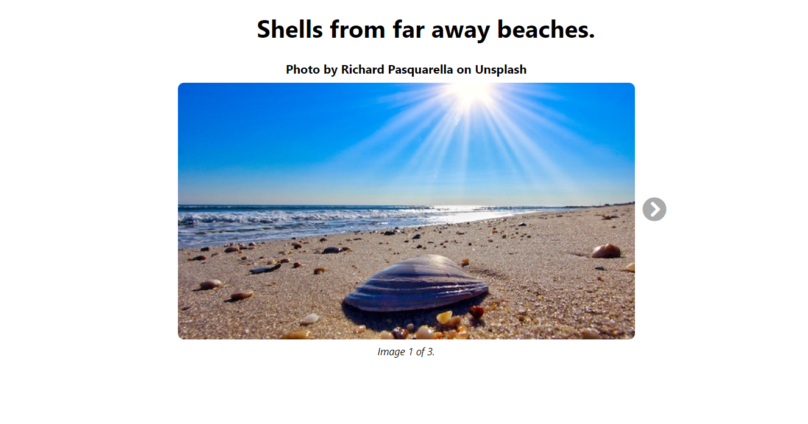

# React State Carousel

## Description: 

Springboard's SWE track provided me some starter code for an image carousel, and my assignment was to write smoke, snapshots, and other react testing library tests to make 
sure it functioned properly. It wasn't backing up image to image with the left arrow. And when you'd press either of the arrows beyond the first or last images, the whole
document becomes empty. These bugs are fixed. Now, the left arrow is missing when you’re on the first image, and that the right arrow is missing when you’re on the last image.
